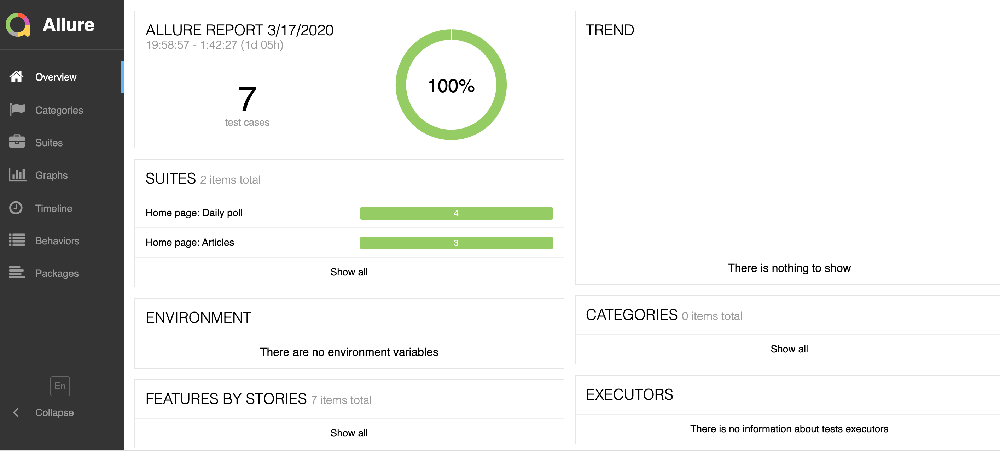

# Ecobee Assignment With WebdriverIO

## Why WebdriverIO
WebdriverIO is a leading automation framework that allows custom implementation for selenium's W3C webdriver API. Written in Javascript and packaged into 'npm', it runs on Node.js. 

The primary reasons for using WebdriverIO for this project includes:

- Simple and easy to use syntax;
- The ability to use Webdriver specification, with easy integration to Appium (mobile automation) allowing to run tests on brower, desktop and mobile;
- It uses an integrated test runner that helps us to write asynchronous commands in a synchronous way so that we don’t need to care about how to handle a Promise to avoid racing conditions;
- The 'wdio setup wizard' allows easy setup for the project;
- Ability to write custom (javascript) functions;
- Test runner makes it easy to customize and modify test based on previous test results (i.e. taking a screenshot when a test fails);
- Ability to integrate with popular tools (i.e Docker, SauceLab, Appium, Applitools, browserstack) makes it a constructive choice.

## Getting Started
To get this project up and running please follow these steps:

- Install NodeJS v8.11.2 or higher on your local machine;
- Clone this project;
- Run "npm install" in any terminal to install necessary packages and libraries;
- Run "npm run test".

## Jasmine JavaScript framework
The tests are written in Jasmine framework. More about Jasmine can be found at https://jasmine.github.io/
Tests are placed in `*.specs.js` files in the `/test/specs/` directory.

## Reporters
WebdriverIO uses several different types of test reporters to show test results (pass/failure). This project is using **Spec** and **Allure** for reporting.

**Spec:**
Test reporter, which prints detailed results to console.

**Allure:**
The Allure Reporter creates Allure test reports which is an HTML generated website with all necessary information to debug the test results and take a look at error screenshots.

To generate and view an allure report locally, run `npm run allure-report`. Following is what a typical Allure report will look like:

## The Page Object Design Pattern
This project is using page object design pattern to avoid duplication of the locators and keep the code and locators more maintainable and clean.